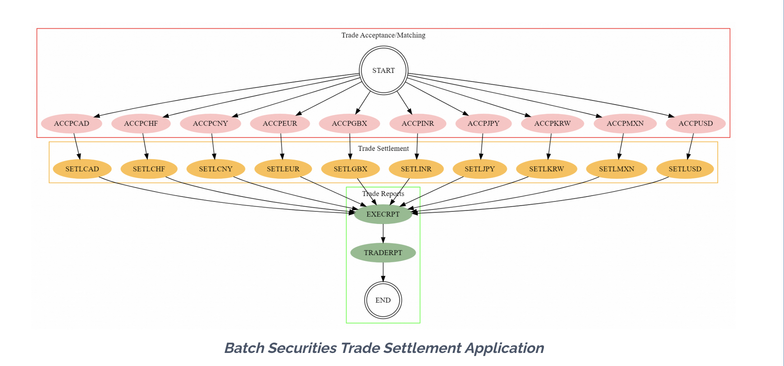
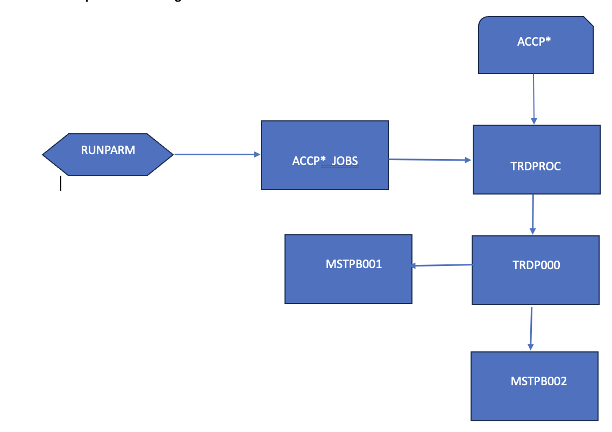
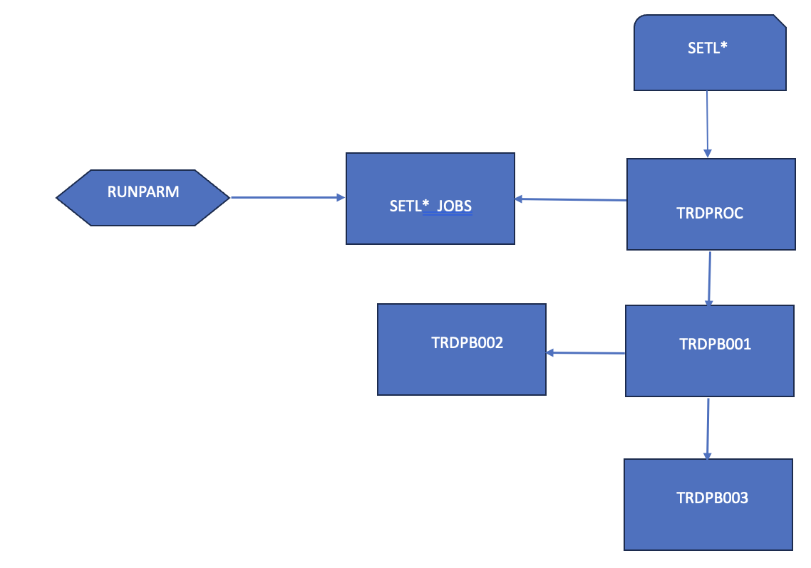
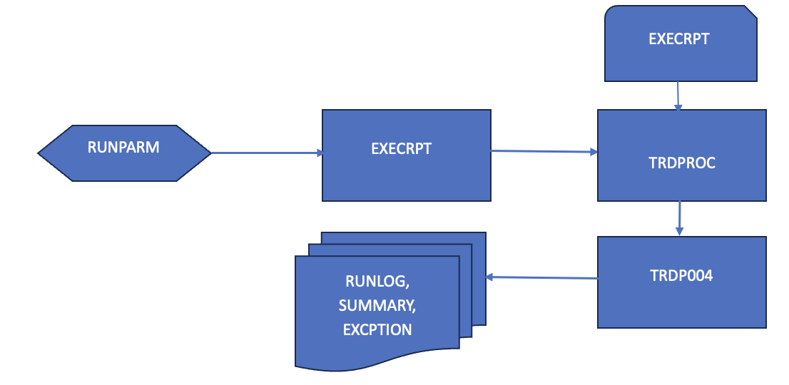
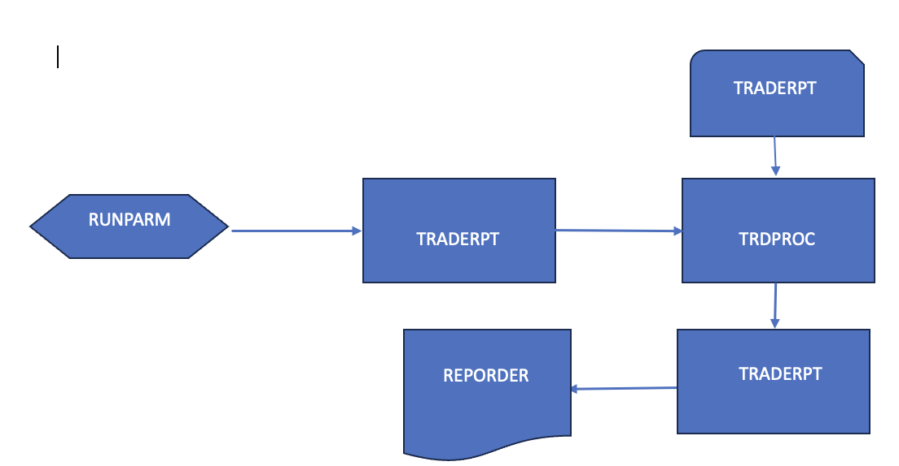

# 🏦 TradingApp – Batch Securities Trade Settlement Application

## 📘 Overview

**TradingApp** is a reference mainframe application created to simulate real-world international securities trading workflows across **10 currencies**. It demonstrates how batch workloads, written in COBOL and JCL, can be analyzed and modernized using **CodeNavigator** — a platform that helps transform legacy mainframe programs into modern **Java**, **Spring Boot**, and **Spring Batch** applications.

The application covers the full trade lifecycle:
- **Matching Buy/Sell Requests**
- **Settlement Processing**
- **Account Balance Updates**
- **Trade and Exception Report Generation**

This application is designed to provide modernization tooling vendors, system integrators, and developers a realistic and complex workload to analyze, transform, and validate.


---

## 🌍 Supported Currencies

- CAD – Canadian Dollar  
- CHF – Swiss Franc  
- CNY – Chinese Yuan Renminbi  
- EUR – Euro  
- GBX – British Pound  
- INR – Indian Rupee  
- JPY – Japanese Yen  
- KRW – Korean Won  
- MXN – Mexican Peso  
- USD – US Dollar

---

## 🧱 Architecture

The application's batch flow consists of three main phases:

### 1. **Acceptance Processing**
Each currency has a corresponding `ACCP*` job that validates and matches incoming Buy/Sell requests. These jobs invoke a common COBOL procedure: `TRDPROC`.



### 2. **Settlement Processing**
Once a trade request is accepted, the corresponding `SETL*` job updates the account balances. Each settlement job must run **after** the associated acceptance job for the same currency.



### 3. **Reporting**
- **Exception Report Job**: Highlights failed or mismatched trades.
- **Trade Report Job**: Summarizes successful transactions.




---

## 🛠️ Technologies Used

- **COBOL**
- **JCL**
- **VSAM**
- **Mainframe Utilities**
- **CodeNavigator** (for modernization analysis and transformation)

---

## 🚀 Modernization with CodeNavigator

This application serves as a benchmark for running your COBOL-to-Java transformation journeys using **CodeNavigator**. You can plug this into your CI/CD pipelines, run transformation tools, and test output fidelity by comparing Java job orchestration against the legacy behavior.

---

## 📁 Repository Structure

```plaintext
├── jcl/                # JCL job control files
├── cobol/              # COBOL source programs
├── procs/              # Shared procedures (e.g., TRDPROC)
├── reports/            # Output report definitions
├── images/             # Architecture diagrams and job flows
└── README.md           # This file
```

---

## 📌 Notes

> For demonstration purposes, this application may intentionally include non-uniform coding patterns, reused control logic, and shared job procs. These are intended to reflect common real-world legacy system designs and are useful for exercising various modernization scenarios.

---

## 🔗 Related Tools

- [CodeNavigator](https://www.cloudframe.com/codenavigator) – Mainframe to Java transformation toolkit.
- [VS Code COBOL Plugin](https://marketplace.visualstudio.com/items?itemName=Bitlang.cobol)

---

## 👥 Contributors

Maintained by the CloudFrame modernization team. For questions or support, please contact: [support@cloudframe.com](mailto:support@cloudframe.com)

